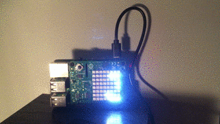

#  Temperature/Humidity/Pressure Data on Led

This demo shows how to use a [Raspberry 3](https://www.raspberrypi.org/products/raspberry-pi-3-model-b/) to display several data collected from the [Sense Hat](https://projects.raspberrypi.org/en/projects/getting-started-with-the-sense-hat/8) using the [`nodeimu`](https://github.com/rupnikj/nodeimu) library using the [resin.io](https://resin.io/) deployment environent

Notes: 
- The `Dockerfile` has been converted from the original `Dockerfile.template` so it can be used in local mode development
- The code rotates 180º the display on the LED so it can be placed with the USB connection towards up 

